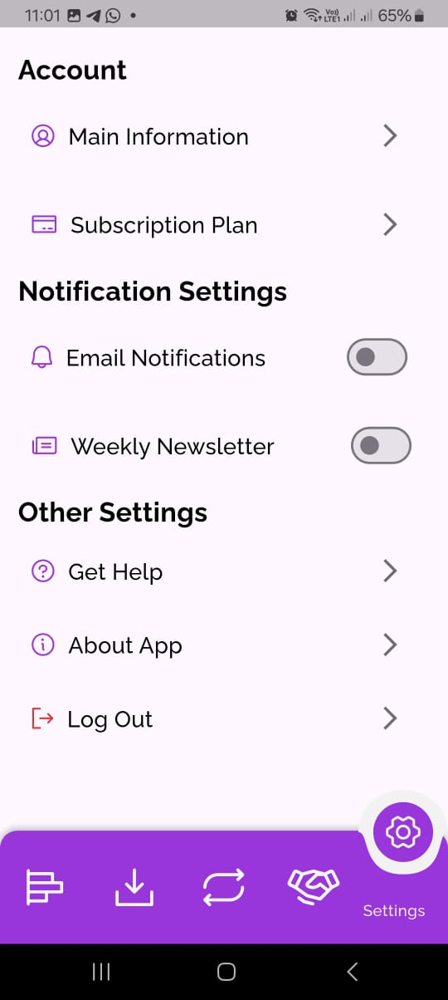
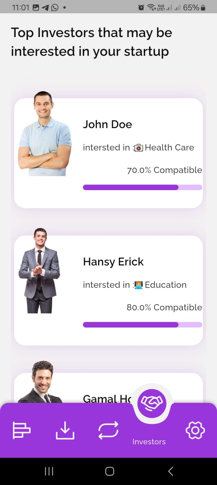
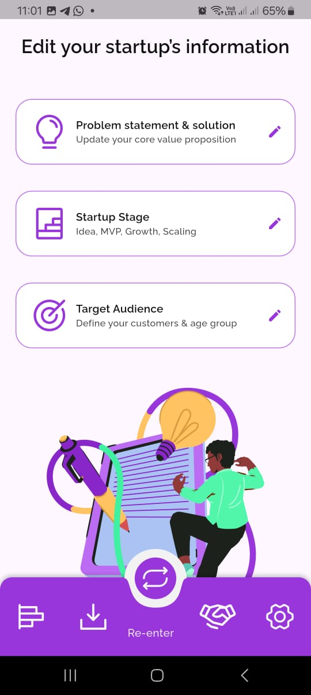
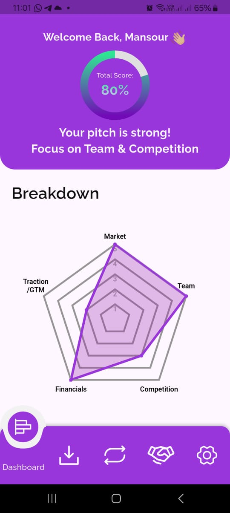
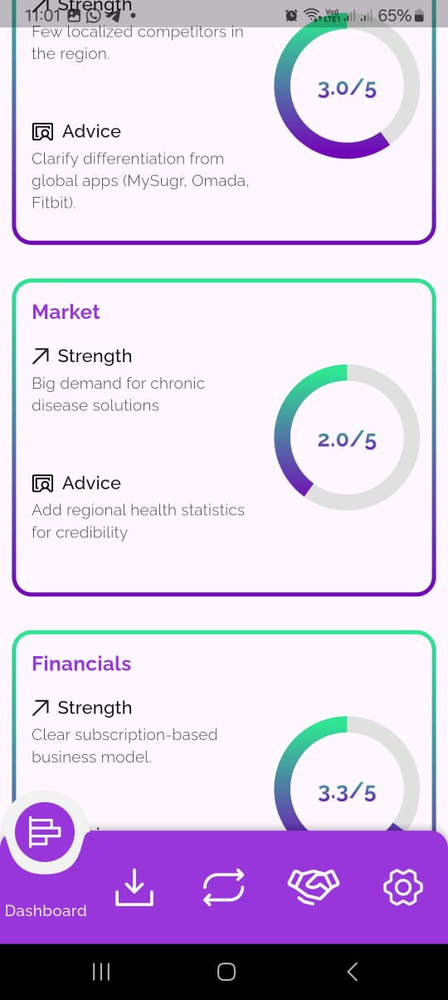
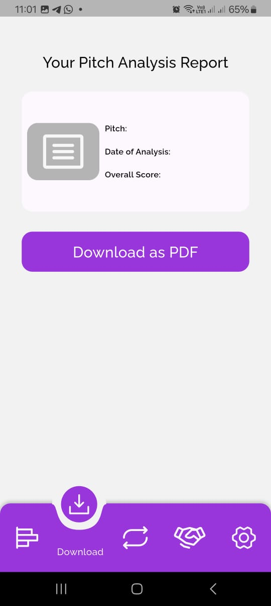

# FounderX 🚀
### AI-Powered Entrepreneurs Assistant

  

## 📖 Overview

**FounderX** is an AI-powered mobile application designed to help early-stage founders transform their innovative ideas into professional, investor-ready pitches. Many promising entrepreneurs struggle to effectively communicate their vision, support it with compelling data, and identify potential risks that could impact their venture's success.

Our intelligent assistant bridges this gap by providing:
- **Smart Pitch Generation**: AI-driven content creation for compelling presentations
- **Data-Backed Insights**: Market research and validation support
- **Risk Assessment**: Comprehensive analysis of potential challenges
- **Investor Readiness**: Professional formatting and presentation tools

  

  &nbsp;
  &nbsp;
  
   
  &nbsp;
  &nbsp;
  

## ✨ Key Features

### 🎯 **Intelligent Pitch Builder**
- AI-powered content generation tailored to your industry
- Professional templates for different investor types
- Real-time suggestions and improvements
- Multi-format export (PDF, PowerPoint, Web)

### 📊 **Market Intelligence**
- Automated market research and analysis
- Competitor landscape mapping
- Industry trend identification
- Target audience insights

### ⚠️ **Risk Analysis Engine**
- Comprehensive risk assessment framework
- Mitigation strategy recommendations
- Financial risk modeling
- Regulatory compliance checks

### 💼 **Investor Tools**
- Pitch deck optimization
- Financial projection templates
- Due diligence preparation
- Investor matching suggestions

### 📱 **Cross-Platform Experience**
- Native iOS and Android apps
- Offline functionality
- Cloud synchronization